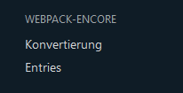
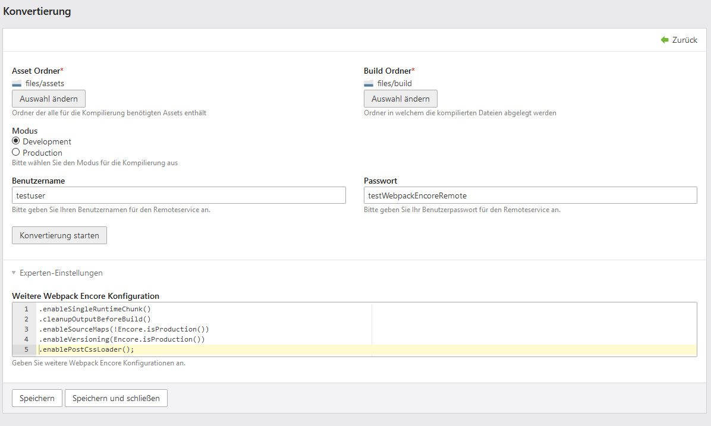
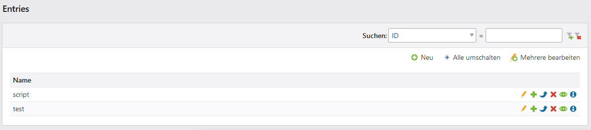
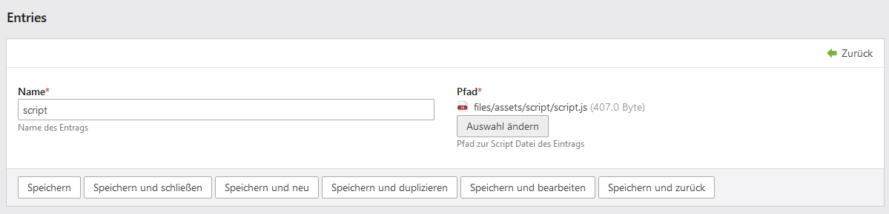
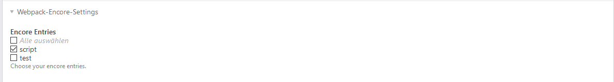

[](https://github.com/postyou/contao-webpack-encore-remote-bundle)

# Contao Webpack-Encore Remote Bundle

Dieses Bundle ermöglicht die Nutzung von Webpack-Encore unkompliziert und schnell direkt in Contao. 
Die Kompilierung wird remote auf einem externen Server ausgeführt, sodass keine Einrichtung von npm und encore auf dem Webserver notwendig ist. 
Zum Testen kann folgender Login verwendet werden:  

login: testuser  
passwort: testWebpackEncoreRemote

Mit diesem Login sind 50 Builds pro Tag möglich. Für weiteres Interesse bitte eine kurze Nachricht an <kontakt@postyou.de>  

Alle Einstellungen und Interaktionen sind komplett in das Contao Backend integriert (siehe Screenshots unten). Für Entwickler steht zudem ein Konsolen Command
zur Verfügung.
 ```sh 
./vendor/bin/contao-console encore:remote 
```


## 

#### Menüeintrag



#### Konvertierung



#### Entries





#### Entry Auswahl in Seiteneinstellungen


