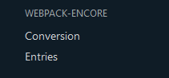
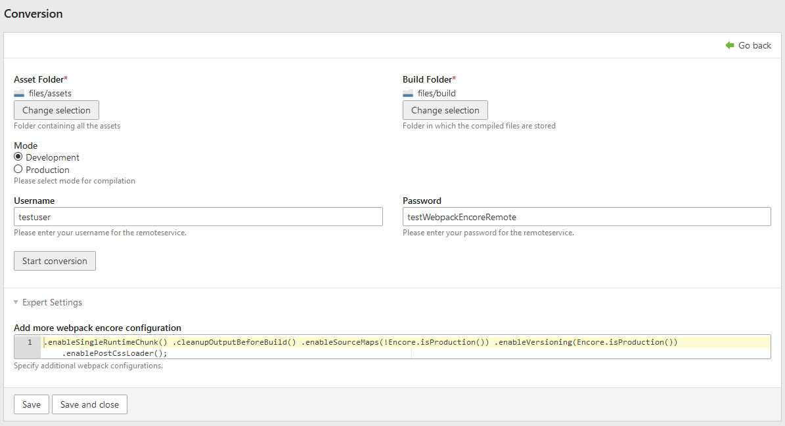
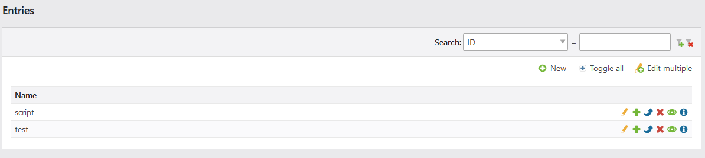
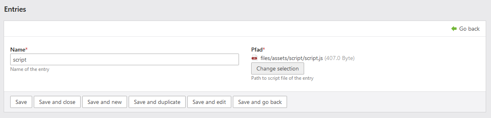
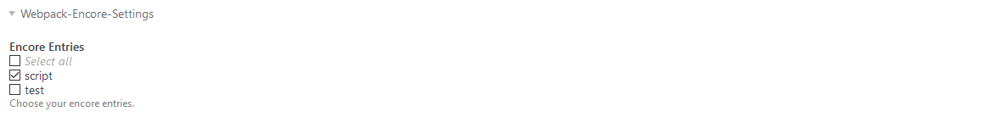

[](https://github.com/postyou/contao-webpack-encore-remote-bundle)

[zur deutschen Version wechseln](README.de.md)

# Contao Webpack-Encore Remote Bundle

This bundle enables the use of Webpack Encore easily and quickly directly in Contao.
Compilation is done remotely on an external server, so no setup of npm and encore on the web server is necessary.
For testing the following login can be used:

login: testuser  
password: testWebpackEncoreRemote

With this login, 50 builds per day are possible. For further interest, please send a short message to <kontakt@postyou.de>

All settings and interactions are completely integrated into the Contao backend (see screenshots below). For developers there is also a console command
available.
 ```sh 
./vendor/bin/contao-console encore:remote 
```


## 

#### Menu entry



#### Conversion



#### Entries





#### Entry choice in Site structure page edit


